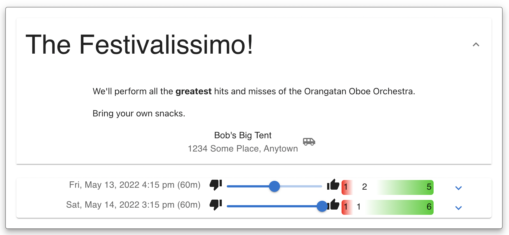
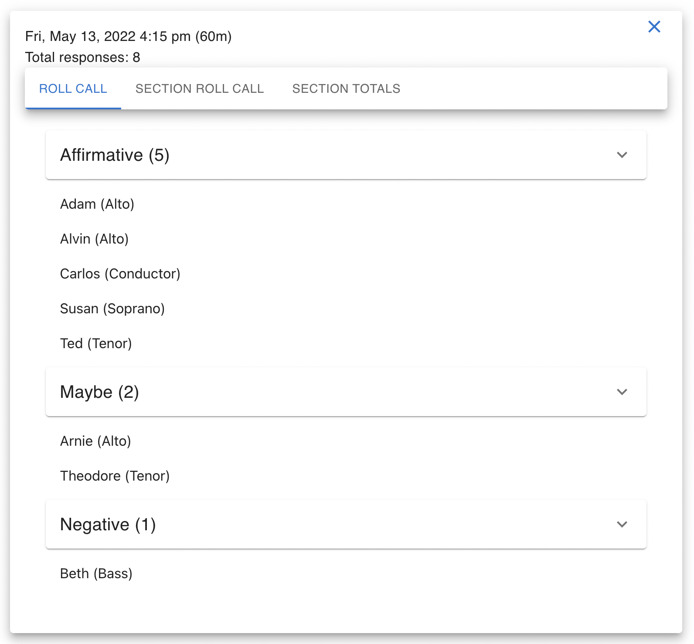
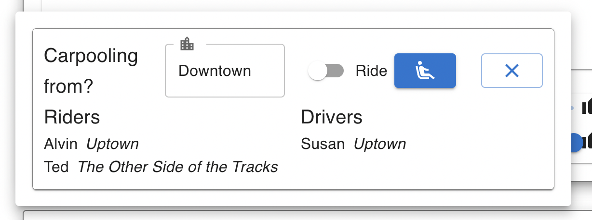

# Authentacat Front End for Cat Wrangler

This project provides a web user interface for [CatWrangler (V2)](https://github.com/jonathanlb/cat-wrangler-v2).
Users can browse and RSVP for events, for example:

Users can see a [Markdown](https://www.markdownguide.org/basic-syntax/)
description of the event,
and RSVP for date-time alternatives.
Each date-time possibility displays a general-interest
(Italian flag) indicator showing the number of positive,
negative, and neutral responses.
Administrators can expand the interest indicator to get
reports on which users plan to attend or not, as well as sectional interest.

Updates from the [initial version](https://github.com/jonathanlb/cat-wrangler) include

- Using [MUI Core web components](https://mui.com/), instead of home-rolled ones built on [yo-yo](https://github.com/maxogden/yo-yo).  The resulting product renders more consistently on smaller screens and conforms to wider usability and accessibility standards.
- Additional tools for users to filter events.
- Using TypeScript.

## Deployment

- Update `config.serverName` in [config.ts](src/config.ts) to point to an end point handled by [the Cat-Wrangler back end](https://github.com/jonathanlb/cat-wrangler-v2).
- Update/add the `homepage` field in [package.json](package.json) if the endpoint is not at the top-level.
- [Setup a Cognito identity pool](https://docs.amplify.aws/lib/auth/getting-started/q/platform/js/)
using [AWS amplify](https://aws.amazon.com/amplify/),
which will write authentication configuration to 
[`src/aws-exports.js`](https://docs.amplify.aws/lib/client-configuration/configuring-amplify-categories/q/platform/js/).
- Run `npm run build` and copy or link the the contents of `build/` to your webserver.

### Ridesharing coordination
There is an optional feature to display participants who wish
to carpool to events for use with
[CatWrangler (v2) 0.2](https://github.com/jonathanlb/cat-wrangler-v2/releases/tag/v0.2.0)
and later.
Enable the feature on the front end by setting `showRideShare` to `true` in
[src/index.tsx](src/index.tsx).

With the rideshare feature, users can click on the shuttle icon next to the venue address in the event details description to display lists of attendees needing rides and willing to provide rides, as well as a neighborhood description.
The user can add her name to either list.

Authentacat nor the backend application handle any further coordination.
Users must contact each other to arrange transport.
## Demo Mode

Whether you'd like to see what the front-end looks like for development or demonstration outside of the application data, Authentacat can be displayed by setting the `demoMode` variable in [`index.ts`](src/index.ts).
Then run `npm run start` and point your browser to [http://localhost:3000](https://localhost:3000).
